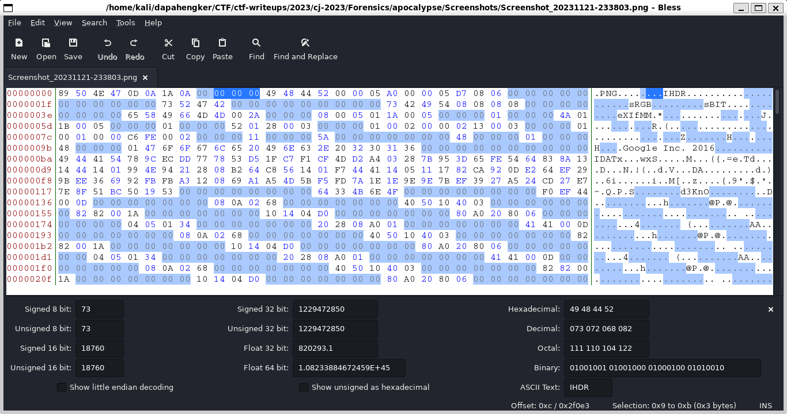

# apocalypse

## Information
**Category:** |
--- | 
Forensics|

## Solution
Given a zip with a two img file, after checking wiht `pngcheck` we can see that both file is corrupted. Then we can check with hexeditor and see the pngchunk is mising/not completed

the correct PNG chunk is like this:
**[4 bytes-length chunk] + [chunk_type] + [chunk_data ]+ [4 bytes-crc]**

For the IHDR, sRGB, sBIT, EXIF, i manually fix it with hexeditor. But for the IDAT chunk, it's too long and many to fix it manually.

So i create a python script [here]('https://gist.github.com/daptheHuman/7ce23269939e3bfcc46e6ab251b391c7') to fix the chunk and save it to a new file.

So the hint is mentioning the CVE from Android Pie
> aCropalypse (CVE 2023-21036) was a vulnerability in Markup, a screenshot editing tool introduced in Google Pixel phones with the release of Android Pie. The vulnerability, discovered in 2023 by security researchers Simon Aarons and David Buchanan, allows an attacker to view an uncropped and unaltered version of a screenshot. 

Which the cropped image is write on top of the uncropped image. So there is a website called https://acropalypse.app/ that can fix the image. 

After fixing the missing/incomplete chunk of the both image, we upload it to the acropalype website and get the uncropped image.

>**CJ2023{cb2aa1108f6aebb88c30}**