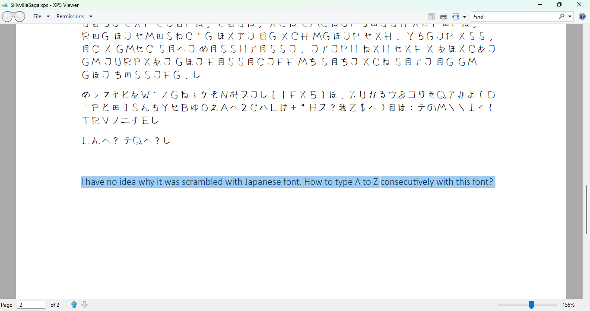
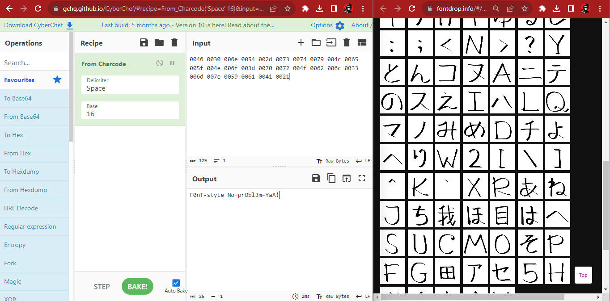

# sillyville_saga

## Information
**Category:** |
--- | 
Forensics|

**Description:** 
~~~
Chopi is a famous short story writer in Teruland. One day, Chopi wanted to
innovate by writing a short story but printed using a custom font that he
created himself. However, his font accidentally got scrambled with another
language's font...
Wrap the flag with NCW23{.*}
~~~
## Solution
Given a xps file, then we can extract the font file using `unzip` command.
```bash
$ unzip SIllyvilleSaga.xps
```


From the given hint in the bottom of xps file, we can see that we need to write A-Z with the font. So we can use [fontdrop](fontdrop.info) to write A-Z with the font.

So we can find the font file in `Documents/Resources/Fonts/`. But the font is in `odttf` format, so we need to convert it to `ttf` using [odttf2ttf](unscramble.py) script.
```shell
$ python unscramble.py 2AAD4BE5-D1F0-45A9-9A5A-977F701828A3.odttf
```

Then we can open the font file using [fontdrop](fontdrop.info)

Then to write the A-Z using the font, we need to type the unicode of the font.
   

> NCW23{F0nT-styLe_No=prObl3m~YaA!}