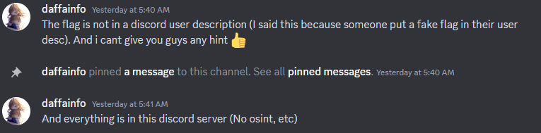
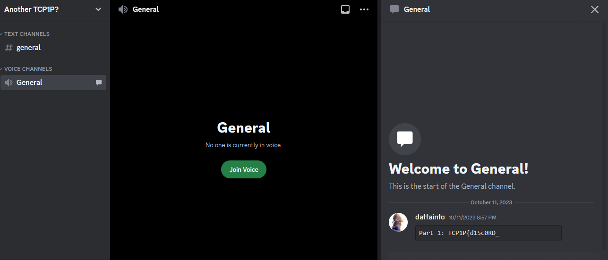
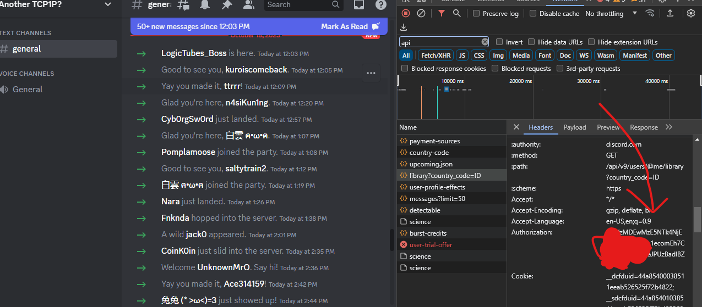
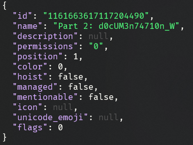
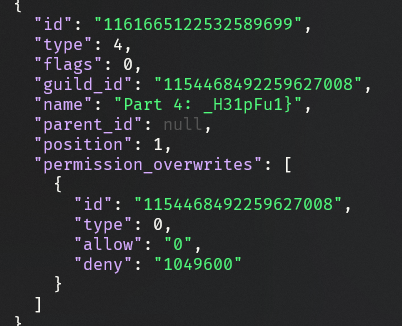

# Another Discord

## Information
**Category:** |
--- | 
Misc |

**Description:** 
~~~
TCP1P has another discord server?

https://discord.gg/kzrryCUutP
~~~

## Solution

So, after finding all the stuff from the discord server i only got part1 and part3

### Part1


Next, We can go discord API documentation https://discord.com/developers/docs/intro. But in order to use the API we need to get and set our discord token, which can be find in `Dev Tools`



We can fetch the guild information using this (We can get server id by turning on Developer Mode)

### Part2
```sh
curl -sH "Authorization: $TOKEN" "https://discord.com/api/v9/guilds/1154468492259627008/" | jq
```
We get part2 as a roles



### Part3
This part actually exists on the discord events section when the ctf run
```sh
curl -s -H "Authorization: $TOKEN" https://discord.com/api/v9/guilds/1154468492259627008/events | jq | grep Part
```
```json
"description": "Part 3: 45_r341ly",
```

### Part4
```sh
❯ curl -sH "Authorization: $TOKEN" "https://discord.com/api/v9/guilds/1154468492259627008/channels" | jq
```

We get part4 as a channel category



> TCP1P{d15c0RD_d0cUM3n74710n_W45_r341ly_H31pFu1}


