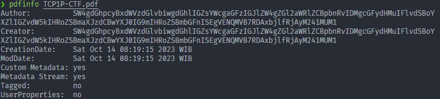
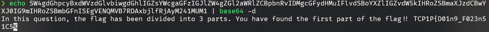
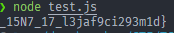

# Ez PDF

## Information
**Category:** |
--- | 
Forensic |

**Description:** 
> I just downloaded this PDF file from a strange site on the internet....

## Solution
Inspecting the PDF with `pdfinfo`
```sh
❯ pdfinfo TCP1P-CTF.pdf
```

We get an b64 string encoded


And then we can get our second flag by converting pdf to html so all the assets get exported
```sh
❯ pdftohtml TCP1P-CTF.pdf    
```

For the last part of the flag we can get JS script using pdfparser 
```sh
❯ ./pdfparser.py TCP1P-CTF.pdf
```
```js
var whutisthis = 2;  // change this into 2 so the script will run
if (whutisthis === 1) {
    this.print({
        bUI: true,
        bSilent: false,
        bShrinkToFit: true
    });
} else {
    function fun_1(_0x4c8c49, _0x29ea76) {
        var _0x5934bd = fun_2();
        return fun_1 = function (v1, v2) {
            v1 = v1 - 0x174;
            var _0x6c8a33 = _0x5934bd[v1];
            return _0x6c8a33;
        }, fun_1(_0x4c8c49, _0x29ea76);
    } (function (_0x39f268, _0x3518a2) {
        var _0x43b398 = fun_1,
            _0x1759ee = _0x39f268();
        while (!![]) {
            try {
                var _0x14396e = -parseInt(_0x43b398(0x175)) / 0x1 * (-parseInt(_0x43b398(0x177)) / 0x2) + parseInt(_0x43b398(0x17e)) / 0x3 + -parseInt(_0x43b398(0x17b)) / 0x4 * (parseInt(_0x43b398(0x179)) / 0x5) + parseInt(_0x43b398(0x183)) / 0x6 * (parseInt(_0x43b398(0x180)) / 0x7) + parseInt(_0x43b398(0x17f)) / 0x8 + -parseInt(_0x43b398(0x17d)) / 0x9 * (-parseInt(_0x43b398(0x17a)) / 0xa) + parseInt(_0x43b398(0x178)) / 0xb * (-parseInt(_0x43b398(0x182)) / 0xc);
                console.log(_0x14396e);
                if (_0x14396e === _0x3518a2) break;
                else _0x1759ee['push'](_0x1759ee['shift']());
            } catch (_0x21db70) {
                _0x1759ee['push'](_0x1759ee['shift']());
            }
        }


    }(fun_2, 0x1d736));


    function pdf() {
        var _0xcd7ad1 = fun_1;
        a = _0xcd7ad1(0x181), b = _0xcd7ad1(0x176), c = _0xcd7ad1(0x174), console[_0xcd7ad1(0x17c)](a + c + b);
    }
    pdf(); // ADD THIS TOO


    function fun_2() {
        var _0x3c1521 = ['_15N7_17', '60PQFHXK', '125706IwDCOY', '_l3jaf9c', '1aRbLpO', 'i293m1d}', '52262iffCez', '211310EDRVNg', '913730rOiDAg', '10xwGGOy', '4mNGkXM', 'log', '747855AiEFNc', '333153VXlPoX', '1265584ccEDtU', '7BgPRoR'];
        fun_2 = function () {
            return _0x3c1521;
        };
        return fun_2();
    }
}
```
With some modification on js script we can get 



## Flag
> TCP1P{D01n9_F023n51C5_0N_pdf_f1L35_15_345y_15N7_17_l3jaf9ci293m1d}