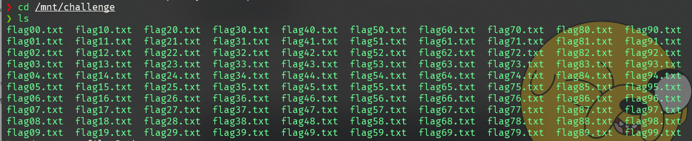
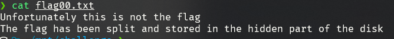
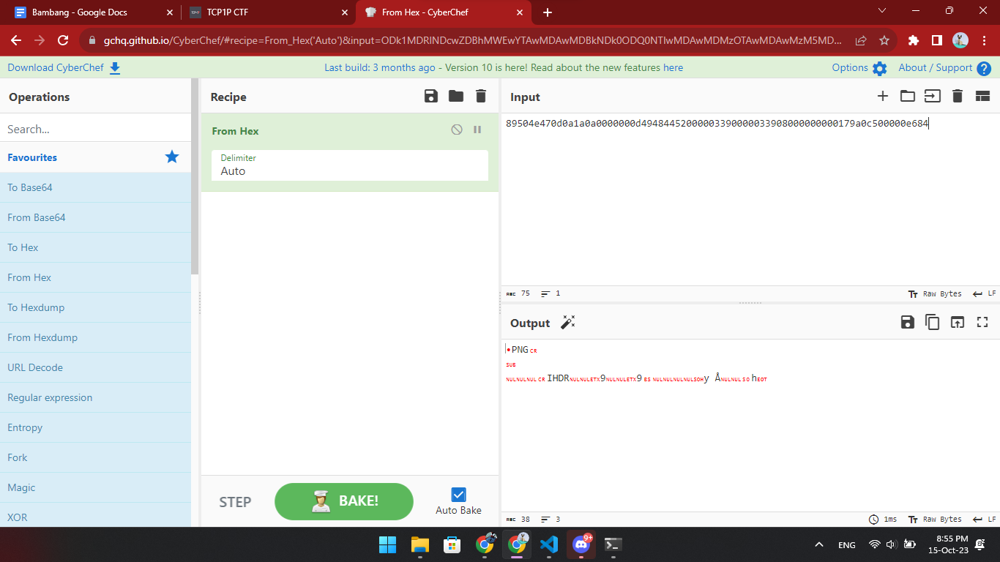
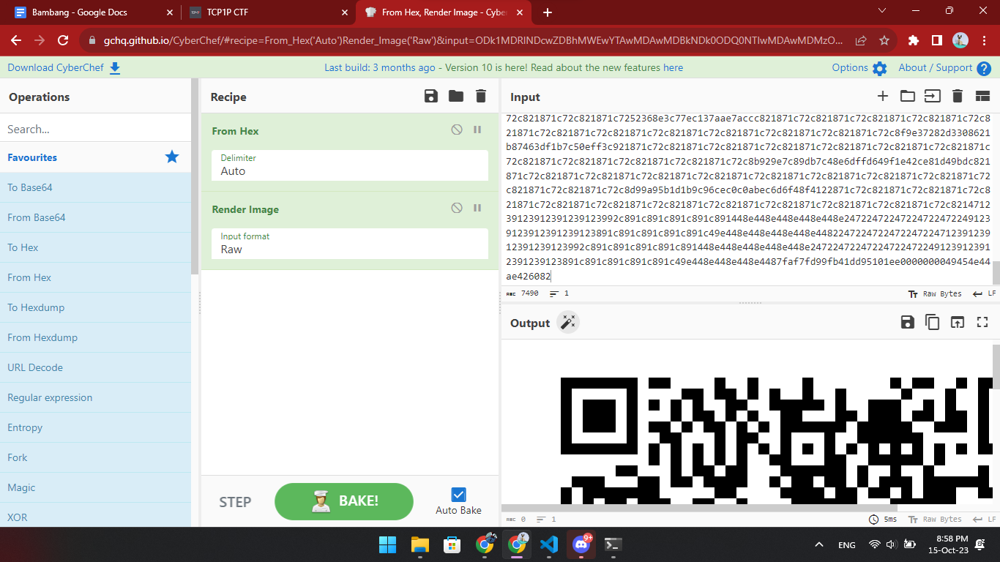
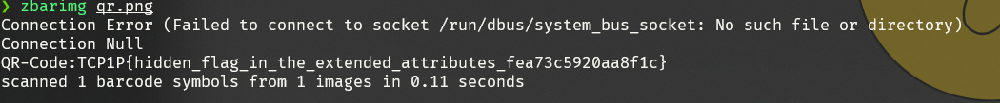

# Hide and Split

## Information
**Category:** |
--- | 
Forensic |

**Description:** 
~~~
Explore this disk image file, maybe you can find something hidden in it.
~~~
## Solution
First we mount using

❯ mount -t ntfs challenge.ntfs /mnt/challenge




We get a list of flag file, and if we try to cat all flag file there is nothing



But the hint **split** is telling that the flag is splitted into all flag file We can inspecting the extended attributes on the files




We can see from above the extended attr value from the first file is a PNG Header

So it means all png is splitted in the all flag files, then we can write a script to get all the extended attr value from all the flag files using `xattr`
```py
value = xattr.getxattr(file_path, f"user.flag{attr}")
```



>TCP1P{hidden_flag_in_the_extended_attributes_fea73c5920aa8f1c}
