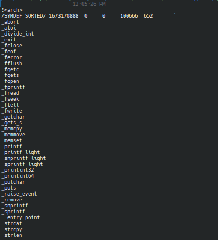

Create a binary file from `ForwardCom` assembly, you can follow the example from the forwardcom repo here [https://github.com/ForwardCom/code-examples/](https://github.com/ForwardCom/code-examples/)

And then since it use the `libc.li` and `math.li` for the standard library, you can use the `libc.li` and `math.li` from the forwardcom repo here [https://github.com/ForwardCom/libraries](https://github.com/ForwardCom/libraries) 

And then u can `strings libc.li` and `strings math.li` to see the function that you can use in the standard library.

Based on the libc.li you can use `_fopen` to open the flag file and print out using `_puts`